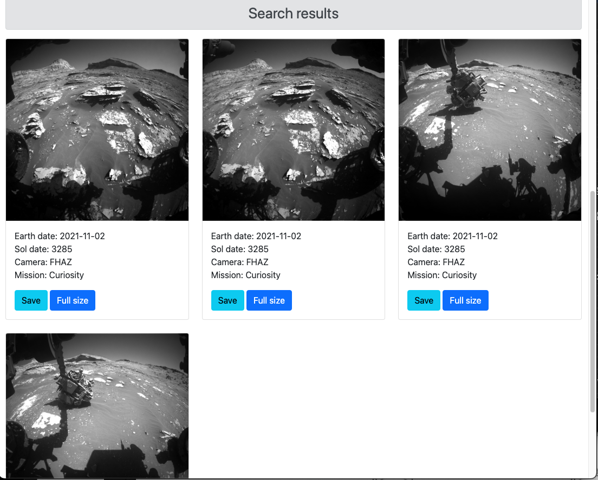

# Project Demo:
This site was built using [Heroku](https://nasa-mars-images.herokuapp.com/login)
# Initialization:
```
Open console, execute : npm install
```
# Execution
```
1. Use the configuration in Webstorm (top right 'play' button)
   or: open terminal, and execute : node bin/www
2. Then open your browser at http://localhost:3000
3. To register on the site, you must set a password of at least 8 characters
```
# Assumptions:
```
The site use bootstrap CDN, execute connection to Nasa server
and local server therefore assumes an internet connection is
available.
```
# App screenshots
 |  
:---: | :---: 
 | 
 | 


